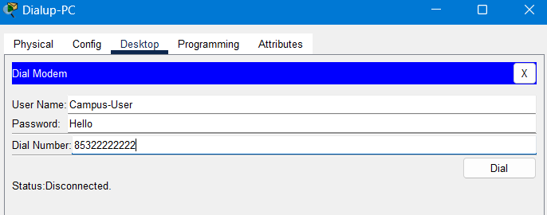

# **Lab 3.WANs Technology**

​																										==SILAN HU==|==2009853P-I011-0015==

#### ==**Objective**==

- Understand the WANs Technologies, including dedicated, circuit-switched and packet-switched networks.

#### ==**Topology**==


#### ==**Address Scheme**==

##### ==**Inside:**==


==**Outside:**==


==**Translation:**==


## **Part 1 – Dedicated Network.**

>  Requirement:
>
> - 1.1 Gateway-Router -> Internet-PC using Enterprise DSL
>
> - 1.2 DSL-PC -> Internet-PC using Personal DSL

### ==Step 1 – Enterprise DSL==

#### 1. configure the DSL on the provider’s site (e.g. ISP-Router)

Reference 5.Q5

```bash
ISP-Router(config)#interface FastEthernet 1/0
ISP-Router(config-if)#ip address 201.201.201.1 255.255.255.0
ISP-Router(config-if)#pppoe enable
ISP-Router(config-if)#no shutdown

ISP-Router(config-if)#no ip route 200.200.123.0 255.255.255.248 200.200.200.2
ISP-Router(config)#ip route 200.200.123.0 255.255.255.248 201.201.201.2
%LINK-5-CHANGED: Interface Virtual-Access1, changed state to up
%LINEPROTO-5-UPDOWN: Line protocol on Interface Virtual-Access1, changed state to up
```


#### 2. configure the DSL on the subscriber’s site. (e.g. Gateway-Router1)

Reference 5.Q13

```bash
Gateway-Router1(config)#interface FastEthernet 1/0
Gateway-Router1(config-if)#ip address 201.201.201.2 255.255.255.0
Gateway-Router1(config-if)#pppoe enable
Gateway-Router1(config-if)#no shutdown

Gateway-Router1(config-if)#no ip route 0.0.0.0 0.0.0.0 200.200.200.1
Gateway-Router1(config)#ip route 0.0.0.0 0.0.0.0 201.201.201.1
%LINK-5-CHANGED: Interface Virtual-Access1, changed state to up
%LINEPROTO-5-UPDOWN: Line protocol on Interface Virtual-Access1, changed state to up
```


#### 3. test the connectivity of the DSL connection.

- From **Gateway-Router1** to **Internet-PC**

```bash
Gateway-Router1#ping 1.2.3.4

Type escape sequence to abort.
Sending 5, 100-byte ICMP Echos to 1.2.3.4, timeout is 2 seconds:
..!!!
Success rate is 60 percent (3/5), round-trip min/avg/max = 42/49/60 ms
```

- From **Teacher-PC1** to **Internet-PC**


### ==Step 2 – Personal DSL==

#### 4. configure the DSL on the provider’s site (e.g. ISP-Router)

Reference 5.Q1~5


```bash
ISP-Router(config)#ip local pool Personal-PPPoEPool 201.201.201.101 201.201.201.199

ISP-Router(config)#interface Virtual-Template 1
ISP-Router(config-if)#ip unnumbered FastEthernet 1/0
ISP-Router(config-if)#peer default ip address pool Personal-PPPoEPool

ISP-Router(config-if)#ppp authentication chap callin
AAA: Warning, authentication list callin is not defined for PPP.
ISP-Router(config-if)#exit

ISP-Router(config)#username DSL-User password Hello

ISP-Router(config)#bba-group pppoe MyGroup
ISP-Router(config-bba)#virtual-template 1

ISP-Router(config-bba)#interface FastEthernet 1/0
ISP-Router(config-if)#pppoe enable group MyGroup
```


#### 5. configure the DSL on the subscriber’s site. (e.g. DSL-PC)

Reference 5.Q7~11


#### 6. test the connectivity of the DSL connection.

- From **DSL-PC** to **Internet-PC**

  


## **Part 2 – Circuit-switched Network.**

> Requirement:
> 2.1 Dialup-PC -> Internet-PC using analog dialup
> 2.2 Dialup-PC -> Teacher-PC/Student-PC/Servers using analog dialup

### ==Step 3 – Analog dialup==

#### 7. configure analog dialup on the provider’s site (e.g. ISP-Router)

Reference 6.Q1~3


```bash
ISP-Router(config)#username Dialup-User password Hello

ISP-Router(config)#ip dhcp excluded-address 202.202.202.1 202.202.202.100
ISP-Router(config)#ip dhcp excluded-address 202.202.202.200 202.202.202.255
ISP-Router(config)#ip dhcp pool Dialup-DHCPPool
ISP-Router(dhcp-config)#network 202.202.202.0 255.255.255.0
ISP-Router(dhcp-config)#default-router 202.202.202.1
```

#### 8. configure analog dialup on the campus’s site (e.g. Gateway-Router1)

Reference 6.Q10~12


```bash
Gateway-Router1(config)#username Campus-User password Hello
Gateway-Router1(config)#ip dhcp pool Dialup-DHCPPool
Gateway-Router1(dhcp-config)#network 172.16.1.0 255.255.255.0
Gateway-Router1(dhcp-config)#default-router 172.16.1.1
Gateway-Router1(dhcp-config)#ip dhcp excluded-address 172.16.1.1 172.16.1.100
Gateway-Router1(config)#ip dhcp excluded-address 172.16.1.200 172.16.1.255
Gateway-Router1(config)#ip dhcp pool Dialup-DHCPPool
Gateway-Router1(dhcp-config)#network 172.16.1.0 255.255.255.0
Gateway-Router1(dhcp-config)#default-router 172.16.1.1
```


#### 9. configure analog dialup on the subscriber’ site (e.g. Dialup-PC)
Reference 6.Q5~9; Q14~18


- ISP-Router

```bash
ISP-Router#show ip interface brief
Interface              IP-Address      OK? Method Status                Protocol 
FastEthernet0/0        1.1.1.1         YES NVRAM  up                    up 
FastEthernet0/1        unassigned      YES NVRAM  administratively down down 
Modem0/0/0             202.202.202.1   YES unset  up                    up 
Modem0/0/1             unassigned      YES unset  down                  down 
FastEthernet1/0        201.201.201.1   YES manual up                    up 
Serial1/0/0            unassigned      YES NVRAM  administratively down down 
Serial1/0/1            unassigned      YES NVRAM  administratively down down 
Virtual-Template1      201.201.201.1   YES unset  down                  down 
Virtual-Access1        unassigned      YES unset  up                    up 
Virtual-Access2        unassigned      YES unset  down                  down 
Vlan1                  unassigned      YES unset  administratively down down
```

> ==Modem0/0/0             202.202.202.1   YES unset  up                    up==

- Dialup-PC

  

  > ip address: ==202.202.202.101==
  
  

#### 10. test the connectivity of the analog dialup connection.




- ISP-Router

```bash
Gateway-Router1#show ip interface brief
Interface              IP-Address      OK? Method Status                Protocol 
FastEthernet0/0        192.168.101.1   YES NVRAM  up                    up 
FastEthernet0/1        192.168.102.1   YES NVRAM  up                    up 
Modem0/0/0             172.16.1.1      YES unset  up                    up 
Modem0/0/1             unassigned      YES unset  down                  down 
FastEthernet1/0        201.201.201.2   YES manual up                    up 
Serial1/0/0            unassigned      YES NVRAM  administratively down down 
Serial1/0/1            unassigned      YES NVRAM  administratively down down 
Virtual-Access1        unassigned      YES unset  up                    up 
Vlan1                  unassigned      YES unset  administratively down down
```

- Dialup-PC


> ip address:==172.16.1.101==

- **From:Dialup-PC** **to Web-Server**


## **Part 3 – Packet-switched Network.**

> Requirement:
> 3.1 Branch-PC -> Teacher-PC/Student-PC/Servers using Frame Relay
> 3.2 Branch-PC -> Internet-PC


### Step 4 – Frame Relay

#### 11. configure frame relay on all site (including Gateway-Router1~3~4)
Reference 7.Q1,2,5,6,12~14

- Gateway-Router1

```bash
Gateway-Router1(config)#interface serial 1/0/0
Gateway-Router1(config-if)#encapsulation frame-relay
Gateway-Router1(config-if)#no ip address
Gateway-Router1(config-if)#no shutdown
Gateway-Router1(config-if)#
%LINK-5-CHANGED: Interface Serial1/0/0, changed state to up
%LINEPROTO-5-UPDOWN: Line protocol on Interface Serial1/0/0, changed state to up
```

- Gateway-Router3

```bash
Gateway-Router3(config)#interface serial 1/0/0
Gateway-Router3(config-if)#encapsulation frame-relay
Gateway-Router3(config-if)#no ip address
Gateway-Router3(config-if)#no shutdown
Gateway-Router3(config-if)#
%LINK-5-CHANGED: Interface Serial1/0/0, changed state to up
%LINEPROTO-5-UPDOWN: Line protocol on Interface Serial1/0/0, changed state to up
```

- Gateway-Router4

 ```bash
 Gateway-Router4(config)#interface Serial 1/0/0
 Gateway-Router4(config-if)#encapsulation frame-relay
 Gateway-Router4(config-if)#no ip address
 Gateway-Router4(config-if)#no shutdown
 Gateway-Router4(config-if)#
 %LINK-5-CHANGED: Interface Serial1/0/0, changed state to up
 %LINEPROTO-5-UPDOWN: Line protocol on Interface Serial1/0/0, changed state to up
 ```

- Adding switching tables

  - FrameRealy-Switch1

    

  

  - FrameRealy-Switch2

    

    
  
    
  
- Setting Frame Relay
  
  - FrameRealy-Switch1
  
    
  
  - FrameRealy-Switch2
  
    
  
- Check whether DLCI is configured successfully for each router

  - **Gateway-Router1**

    ```bash
    Gateway-Router1#show frame-relay pvc
    
    PVC Statistics for interface Serial1/0/0 (Frame Relay DTE)
    DLCI = 103, DLCI USAGE = LOCAL, PVC STATUS = ACTIVE, INTERFACE = Serial1/0/0
    
    input pkts 14055       output pkts 32795        in bytes 1096228
    out bytes 6216155      dropped pkts 0           in FECN pkts 0
    in BECN pkts 0         out FECN pkts 0          out BECN pkts 0
    in DE pkts 0           out DE pkts 0
    out bcast pkts 32795   out bcast bytes 6216155
    
    DLCI = 104, DLCI USAGE = LOCAL, PVC STATUS = ACTIVE, INTERFACE = Serial1/0/0
    
    input pkts 14055       output pkts 32795        in bytes 1096228
    out bytes 6216155      dropped pkts 0           in FECN pkts 0
    in BECN pkts 0         out FECN pkts 0          out BECN pkts 0
    in DE pkts 0           out DE pkts 0
    out bcast pkts 32795   out bcast bytes 6216155
    ```

  - **Gateway-Router3**

    ```bash
    Gateway-Router3#show frame-relay pvc
    
    PVC Statistics for interface Serial1/0/0 (Frame Relay DTE)
    DLCI = 301, DLCI USAGE = LOCAL, PVC STATUS = ACTIVE, INTERFACE = Serial1/0/0
    
    input pkts 14055       output pkts 32795        in bytes 1096228
    out bytes 6216155      dropped pkts 0           in FECN pkts 0
    in BECN pkts 0         out FECN pkts 0          out BECN pkts 0
    in DE pkts 0           out DE pkts 0
    out bcast pkts 32795   out bcast bytes 6216155
    ```

  - **Gateway-Router4**

    ```bash
    Gateway-Router4#show frame-relay pvc
    
    PVC Statistics for interface Serial1/0/0 (Frame Relay DTE)
    DLCI = 401, DLCI USAGE = LOCAL, PVC STATUS = ACTIVE, INTERFACE = Serial1/0/0
    
    input pkts 14055       output pkts 32795        in bytes 1096228
    out bytes 6216155      dropped pkts 0           in FECN pkts 0
    in BECN pkts 0         out FECN pkts 0          out BECN pkts 0
    in DE pkts 0           out DE pkts 0
    out bcast pkts 32795   out bcast bytes 6216155
    ```

-  **Corresponding Gateway Router** Setting

  - **Gateway-Router1**

    ```bash
    Gateway-Router1(config)#interface serial 1/0/0.1 multipoint
    Gateway-Router1(config-subif)#frame-relay interface-dlci 103
    Gateway-Router1(config-subif)#frame-relay interface-dlci 104
    Gateway-Router1(config-subif)#ip address 172.16.2.1 255.255.255.0
    %LINK-5-CHANGED: Interface Serial1/0/0.1, changed state to up
    %LINEPROTO-5-UPDOWN: Line protocol on Interface Serial1/0/0.1, changed state to up
    
    Gateway-Router1#show frame-relay map
    Serial1/0/0.1 (up): ip 172.16.2.4 dlci 104, dynamic, 
                  broadcast, 
                  CISCO, status defined, active
    Serial1/0/0.1 (up): ip 172.16.2.3 dlci 103, dynamic, 
                  broadcast, 
                  CISCO, status defined, active
    ```

  - **Gateway-Router3**

    ```bash
    Gateway-Router3(config)#interface serial 1/0/0.3 multipoint
    Gateway-Router3(config-subif)#frame-relay interface-dlci 301
    Gateway-Router3(config-subif)#ip address 172.16.2.3 255.255.255.0
    %LINK-5-CHANGED: Interface Serial1/0/0.3, changed state to up
    %LINEPROTO-5-UPDOWN: Line protocol on Interface Serial1/0/0.3, changed state to up
    
    Gateway-Router3#show frame-relay map
    Serial1/0/0.3 (up): ip 172.16.2.1 dlci 301, dynamic, 
                  broadcast, 
                  CISCO, status defined, active
    ```

  - **Gateway-Router4**

    ```bash
    Gateway-Router4(config)#interface serial 1/0/0.4 multipoint
    Gateway-Router4(config-subif)#frame-relay interface-dlci 401
    Gateway-Router4(config-subif)#ip address 172.16.2.4 255.255.255.0
    %LINK-5-CHANGED: Interface Serial1/0/0.4, changed state to up
    %LINEPROTO-5-UPDOWN: Line protocol on Interface Serial1/0/0.4, changed state to up
    
    Gateway-Router4#show frame-relay map
    Serial1/0/0.4 (up): ip 172.16.2.1 dlci 401, dynamic, 
                  broadcast, 
                  CISCO, status defined, active
    ```

- Testing 

  - **Gateway-Router1** to **Gateway-Router3**

    ```bash
    Gateway-Router1#ping 172.16.2.3
    
    Type escape sequence to abort.
    Sending 5, 100-byte ICMP Echos to 172.16.2.3, timeout is 2 seconds:
    !!!!!
    Success rate is 100 percent (5/5), round-trip min/avg/max = 6/6/8 ms
    ```

  - **Gateway-Router1** to **Gateway-Router4**

    ```bash
    Gateway-Router1#ping 172.16.2.4
    
    Type escape sequence to abort.
    Sending 5, 100-byte ICMP Echos to 172.16.2.4, timeout is 2 seconds:
    !!!!!
    Success rate is 100 percent (5/5), round-trip min/avg/max = 6/6/7 ms
    ```

  - **Gateway-Router3** to **Gateway-Router1**

    ```bash
    Gateway-Router3#ping 172.16.2.1
    
    Type escape sequence to abort.
    Sending 5, 100-byte ICMP Echos to 172.16.2.1, timeout is 2 seconds:
    !!!!!
    Success rate is 100 percent (5/5), round-trip min/avg/max = 3/22/34 ms
    ```

  - **Gateway-Router4** to **Gateway-Router1**

    ```bash
    Gateway-Router4#ping 172.16.2.1
    
    Type escape sequence to abort.
    Sending 5, 100-byte ICMP Echos to 172.16.2.1, timeout is 2 seconds:
    !!!!!
    Success rate is 100 percent (5/5), round-trip min/avg/max = 16/25/33 ms
    ```

### Step 5 – Routing

#### 12. configure the routing information, dhcp, and nat, so that all PCs can ping each other.

```bash
Gateway-Router1(config)#ip dhcp excluded-address 192.168.33.1 192.168.33.100
Gateway-Router1(config)#ip dhcp excluded-address 192.168.33.200 192.168.33.255
Gateway-Router1(config)#ip dhcp excluded-address 192.168.44.1 192.168.44.100
Gateway-Router1(config)#ip dhcp excluded-address 192.168.44.200 192.168.44.255
Gateway-Router1(config)#ip dhcp pool Branch3-DHCPPool
Gateway-Router1(dhcp-config)#network 192.168.33.0 255.255.255.0
Gateway-Router1(dhcp-config)#default-router 192.168.33.1
Gateway-Router1(dhcp-config)#exit
Gateway-Router1(config)#ip dhcp pool Branch4-DHCPPool
Gateway-Router1(dhcp-config)#network 192.168.44.0 255.255.255.0
Gateway-Router1(dhcp-config)#default-router 192.168.44.1
Gateway-Router1(dhcp-config)#exit

Gateway-Router1(config)#ip route 192.168.33.0 255.255.255.0 172.16.2.3
Gateway-Router1(config)#ip route 192.168.44.0 255.255.255.0 172.16.2.4
```

```bash
Gateway-Router3(config)#interface fastEthernet 0/0
Gateway-Router3(config-if)#ip address 192.168.33.1 255.255.255.0
Gateway-Router3(config-if)#no shutdown

Gateway-Router3(config-if)#ip helper-address 192.168.101.1
Gateway-Router3(config-if)#exit
Gateway-Router3(config)#ip route 192.168.0.0 255.255.0.0 172.16.2.1
Gateway-Router3(config)#ip route 192.168.44.0 255.255.255.0 172.16.2.4
Gateway-Router3(config)#ip route 0.0.0.0 0.0.0.0 172.16.2.1
```

```bash
Gateway-Router4(config)#interface fastEthernet 0/0
Gateway-Router4(config-if)#ip address 192.168.44.1 255.255.255.0
Gateway-Router4(config-if)#no shutdown

Gateway-Router4(config-if)#ip helper-address 192.168.101.1
Gateway-Router4(config-if)#exit

Gateway-Router4(config)#ip route 192.168.0.0 255.255.0.0 172.16.2.1
Gateway-Router4(config)#ip route 192.168.33.0 255.255.255.0 172.16.2.3
Gateway-Router4(config)#ip route 0.0.0.0 0.0.0.0 172.16.2.1
```

```bash
Gateway-Router1(config)#interface serial 1/0/0.1 multipoint

Gateway-Router1(config-subif)#ip nat inside

Gateway-Router1(config-subif)#no ip access-list standard NAT-List

Gateway-Router1(config)#ip access-list standard NAT-List

Gateway-Router1(config-std-nacl)#permit 192.168.11.0 0.0.0.255

Gateway-Router1(config-std-nacl)#permit 192.168.22.0 0.0.0.255
Gateway-Router1(config-std-nacl)#permit 192.168.88.0 0.0.0.255
Gateway-Router1(config-std-nacl)#permit 192.168.33.0 0.0.0.255
Gateway-Router1(config-std-nacl)#permit 192.168.44.0 0.0.0.255
```

#### 13. test the connectivity of the frame relay connection.

- request DHCP with Branch PC
  - Branch-PC3
	  
  - Branch-PC4
	  

- **Branch-PC3** to **Internet-PC**

  

- **Branch-PC4** to **Internet-PC**

  
